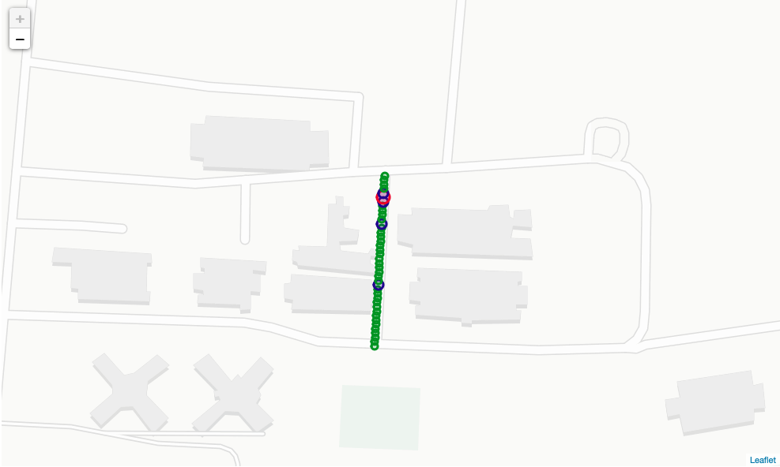
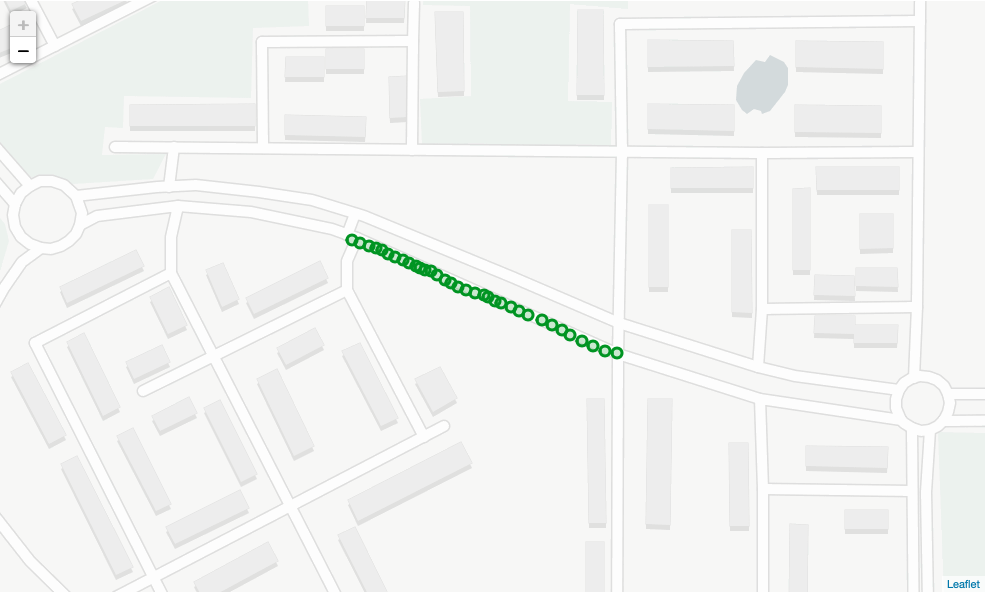
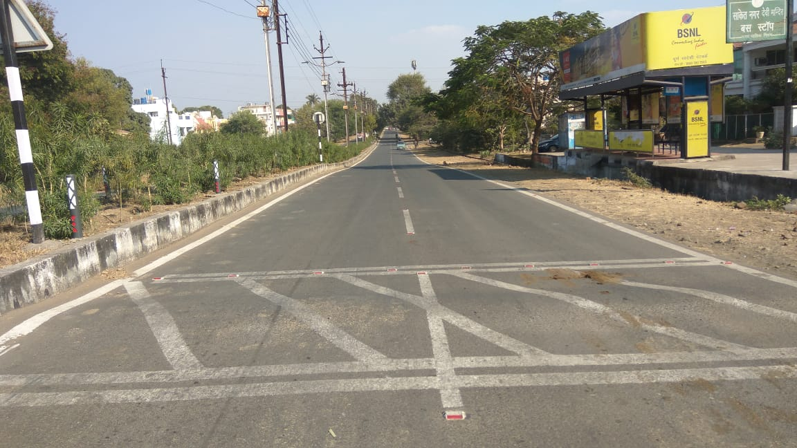
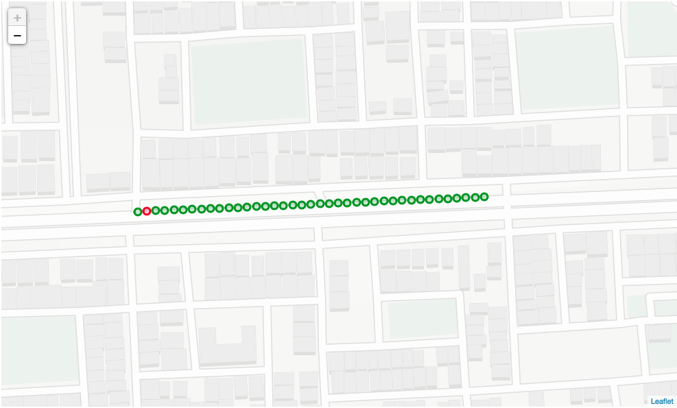

# Road-Condition-Analysis
Analysis for the data on condition of roads collected with the use of Raspberry Pi. This is a part of two-part project, have a look at the data acquisition module here: https://github.com/AnshulHedau/Road-Condition-Acquisition.

# Getting Started
Have a look at the *[Road Condition Analysis.ipynb](https://github.com/Dheeraj1998/Road-Condition-Analysis/blob/master/Road%20Condition%20Analysis.ipynb)* file for diving into the analysis part of the data acquired from the sensors. The data has also been visualised on a map in the *[road_analysis.html](https://github.com/Dheeraj1998/Road-Condition-Analysis/blob/master/road_analysis.html)* file.

# Screenshots
The analysis of the roads from the hardware can be visualised on a webpage (using Google Maps) or on the Jupyter Notebook itself with the help of Folium. The different sizes of the transparent circles indicate the condition of the roads at the particular points. The level of severity from highest to lowest is as follows: ***red** (largest circle)* -> ***blue** (medium circle)* -> ***green** (small circle)*.

</img> </img>

</img> </img>

</img> </img>
